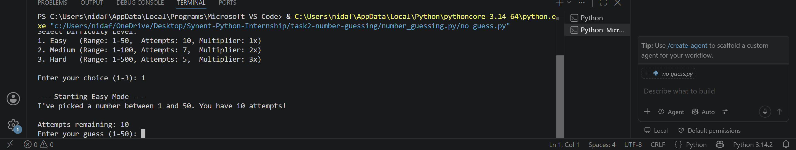
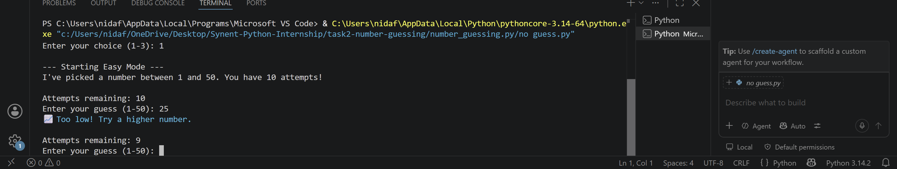
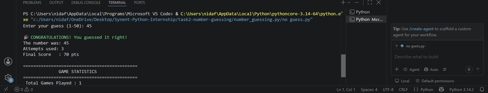
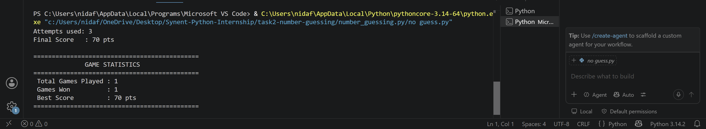

# Synent Task 2: Ultimate CLI Number Guessing Game

An interactive, feature-rich Command Line Interface (CLI) Number Guessing Game built in Python for the Synent Technologies Internship Program.

## 📌 Project Overview
This project upgrades the classic number guessing game into a complete terminal arcade experience. It features multiple difficulty tiers, real-time directional feedback, dynamic score multipliers, smart bonus clues, robust error handling, ANSI terminal coloring, and cumulative game session statistics.

## 🛠️ Methodology & Logic
- **Randomization:** Uses Python's built-in `random.randint()` function to dynamically seed and select secret values based on chosen difficulty ranges.
- **Conditional Evaluation & Hints:** Employs comparison logic to calculate distance from the secret number and output high/low feedback. 
- **Bonus Clue System:** Analyzes attempt counters to unlock modulo-based logic (`number % 2 == 0`) for odd/even hints when guesses run low.
- **Input Validation:** Wraps user inputs inside `try-except` blocks catching `ValueError` exceptions to protect against invalid characters and out-of-bounds inputs.

## ✨ Key Features
- **🎚️ Multiple Difficulty Levels:**
  - **Easy:** Range 1–50 | 10 Attempts | 1x Score Multiplier
  - **Medium:** Range 1–100 | 7 Attempts | 2x Score Multiplier
  - **Hard:** Range 1–500 | 5 Attempts | 3x Score Multiplier
- **🧠 Real-Time Hints:** Directional guidance (Too High / Too Low) after every guess.
- **💡 Smart Bonus Clues:** Automatically reveals whether the secret number is EVEN or ODD when attempts are down to 2.
- **🏆 Dynamic Scoring:** Calculates scores based on remaining attempts and difficulty scaling.
- **🛡️ Robust Input Validation:** Catches non-numeric inputs and out-of-range guesses without crashing.
- **🎨 Terminal Styling:** Styled output using ANSI color codes for an enhanced user experience.
- **📊 Session Statistics:** Tracks total games played, total wins, and highest score across multiple rounds.

## 📷 Screenshots & Execution Walkthrough

### 1. Menu & Difficulty Selection


### 2. Gameplay & Dynamic Hints


### 3. Bonus Clues & Feedback


### 4. Victory & Session Summary


## 💻 Example Output
```text
=============================================
   🎯 ULTIMATE NUMBER GUESSING GAME 🎯    
=============================================
Select Difficulty Level:
1. Easy (Range: 1-50, Attempts: 10, Multiplier: 1x)
2. Medium (Range: 1-100, Attempts: 7, Multiplier: 2x)
3. Hard (Range: 1-500, Attempts: 5, Multiplier: 3x)
Enter your choice (1-3): 1

--- Starting Easy Mode --- 
I've picked a number between 1 and 50. You have 10 attempts!

Attempts remaining: 10 
Enter your guess (1-50): 25 
📈 Too low! Try a higher number.
